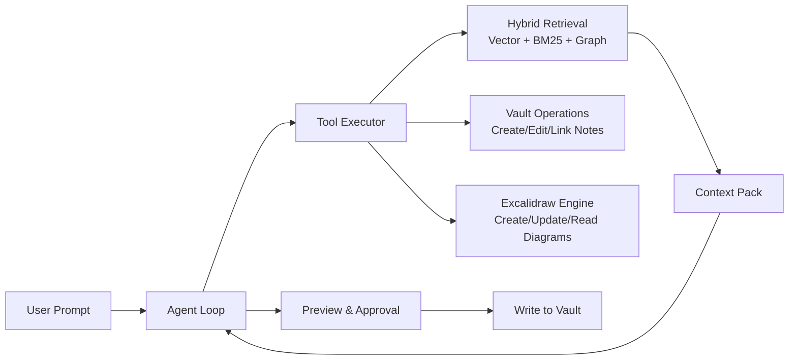

# Thought Agent for Obsidian

Thought Agent is an AI-powered Obsidian plugin designed to work with your notes, links, and diagrams as a single knowledge graph.

It helps you:

- chat with your vault content,
- discover related notes through semantic + graph search,
- propose safe, preview-based edits,
- create and update Excalidraw diagrams from structured intent.

## Visual Overview



## Core Features

- Hybrid retrieval pipeline: semantic vectors + BM25 keyword scoring + graph-enhanced reranking.
- Safe write workflow: all note and diagram changes are proposed first, then approved by the user.
- Excalidraw integration: read/search diagrams, generate new diagrams, and update existing ones.
- Deterministic layout engine: stable node placement, edge anchoring from shape boundaries, and layered drawing order.
- Session constraints: filter by tags/folders and apply custom instructions per session.
- Multi-provider LLM support: Anthropic and OpenAI-compatible local endpoints (LM Studio).

## Excalidraw Capabilities

- Create diagram types: `mindmap`, `flowchart`, `timeline`, `entity-graph`.
- Optional AI-provided `x`/`y` coordinates for precise placement.
- Arrow routing anchored to node boundaries (rectangle/ellipse/diamond aware).
- Rendering layer policy: connectors (`arrow`, `line`) stay behind text and shapes.
- Diagram output path policy:
  - all diagrams are created under the configured default diagram folder,
  - if the setting is empty, `Diagrams` is used automatically,
  - any requested folder is treated as a subfolder under that base.

## Project Structure

- `src/agent` - agent loop, system prompt, tool execution.
- `src/retrieval` - chunking, embeddings, indexing, hybrid search.
- `src/excalidraw` - diagram extraction, indexing, watching, layout engine.
- `src/views` - chat, preview, and graph query views.
- `src/providers` - LLM provider adapters.
- `src/changes` - pending change model and apply flow.

## Requirements

- Node.js 18+
- npm
- Obsidian Desktop
- Excalidraw Obsidian plugin (optional but required for diagram tools)

## Development

Install dependencies:

```bash
npm install
```

Start development build/watch:

```bash
npm run dev
```

Run production build:

```bash
npm run build
```

## Configuration

Open Obsidian settings for Thought Agent and configure:

- provider (`anthropic` or `lmstudio`),
- model and endpoint details,
- max agent iterations,
- diagram defaults (folder, watcher, embed style).

## Suggested Workflow

1. Re-index your vault.
2. Ask a question in chat.
3. Let the agent search notes and gather context.
4. Review proposed edits/diagrams in Preview.
5. Approve only what you want written.

## License

MIT
