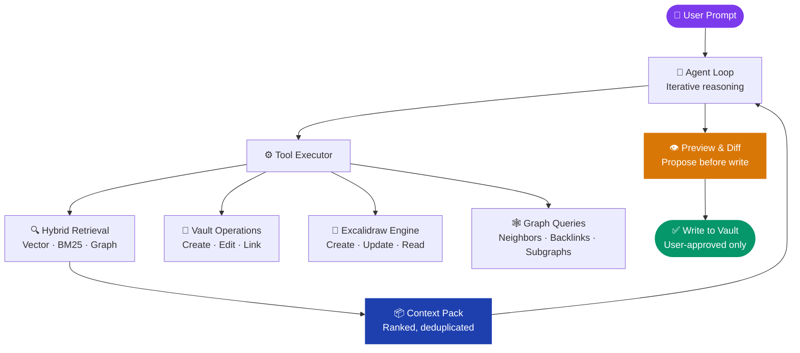
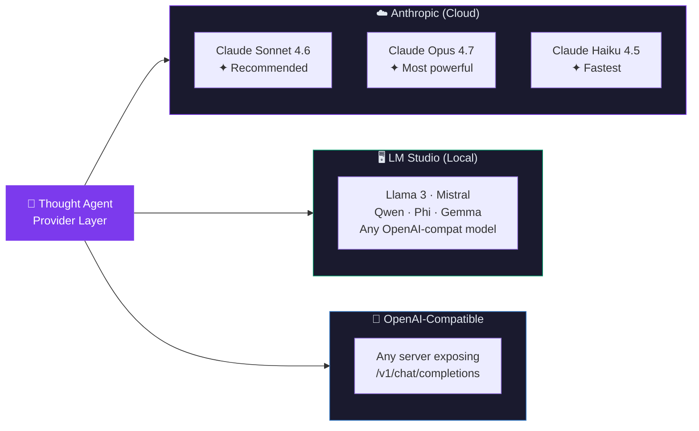
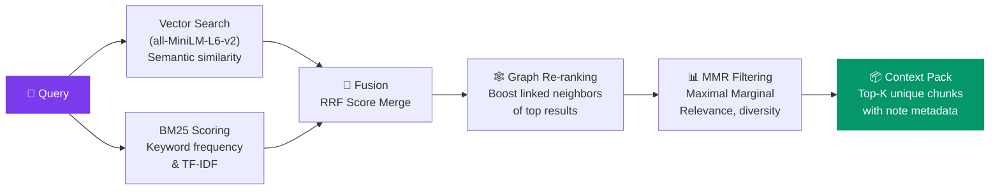
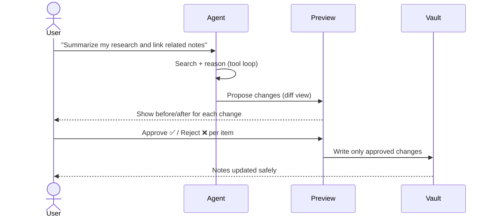
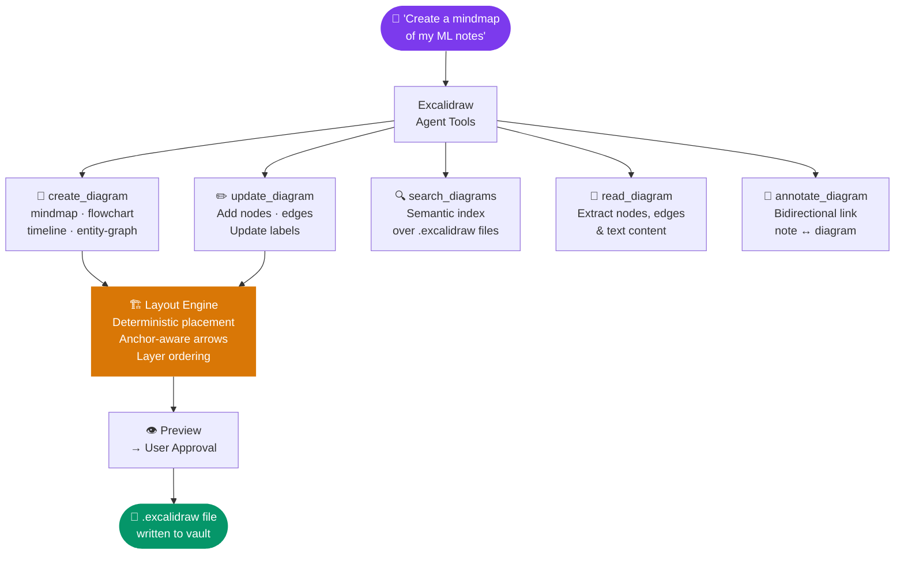

<div align="center">

# 🧠 Thought Agent

### *Your vault doesn't just store knowledge, it thinks with you.*

**An AI-powered Obsidian plugin that treats your notes, links, and diagrams as a living knowledge graph.**

[](./manifest.json)
[](https://obsidian.md)
[](./LICENSE)
[](https://www.typescriptlang.org/)
[](https://nodejs.org/)

</div>

---

## ✦ What is Thought Agent?

Thought Agent is not a chatbot bolted onto your notes. It is an **autonomous reasoning agent** that navigates your vault like a researcher, searching semantically, traversing graph links, proposing safe edits, and generating visual diagrams, all without touching a single file until *you* approve.

> *"Think of it as a second brain for your second brain."*

---

## 📦 Installation

### Option 1, BRAT (recommended for early adopters)

[BRAT](https://github.com/TfTHacker/obsidian42-brat) lets you install plugins directly from GitHub without waiting for the official Obsidian store.

1. Install **Obsidian42 - BRAT** from the Obsidian Community Plugins store.
2. Open Obsidian → **Settings → BRAT → Add Beta Plugin**.
3. Paste the repository URL:
   ```
   https://github.com/tugberkakbulut/thought-obsidian
   ```
4. Click **Add Plugin**, BRAT downloads and enables it automatically.
5. Go to **Settings → Community Plugins** and toggle **Thought Agent** on.

---

### Option 2, Manual installation

1. Go to the [**Releases**](https://github.com/tugberkakbulut/thought-obsidian/releases) page and download the latest:
   - `main.js`
   - `manifest.json`
   - `styles.css`
2. Copy all three files into your vault's plugins folder:
   ```
   <your-vault>/.obsidian/plugins/thought-agent/
   ```
3. Restart Obsidian (or reload without saving).
4. Go to **Settings → Community Plugins** and toggle **Thought Agent** on.

---

### Option 3, Build from source

```bash
# Clone into your vault's plugins folder
git clone https://github.com/tugberkakbulut/thought-obsidian \
  "<your-vault>/.obsidian/plugins/thought-agent"

cd "<your-vault>/.obsidian/plugins/thought-agent"
npm install
npm run build
```

Then enable the plugin in Obsidian as above.

---

## 🚀 Quick Start

### Step 1, Configure a provider

Open **Obsidian → Settings → Thought Agent** and pick your LLM provider:

**Using Anthropic (Claude):**
- Set **Provider** → `Anthropic`
- Paste your [Anthropic API key](https://console.anthropic.com/) (`sk-ant-...`)
- Select a model, **Claude Sonnet 4.6** is recommended for the best balance of speed and power

**Using a local model (LM Studio):**
- Download and open [LM Studio](https://lmstudio.ai), load any model, and start the local server
- Set **Provider** → `LM Studio`
- Default URL is `http://localhost:1234/v1`, hit **Test** to confirm it's reachable
- Your prompts never leave your machine 🔒

---

### Step 2, Index your vault

In **Settings → Thought Agent**, click **Re-index vault**.  
This builds the local semantic index (~25 MB model download on first run). You only need to do this once, and again after adding many new notes.

---

### Step 3, Open the chat

Click the **🧠 Thought Agent** icon in the left sidebar (or run *"Open Thought Agent chat"* from the Command Palette).

**Example prompts to try:**

```
"What do my notes say about machine learning?"
"Summarize my research on [[Attention Mechanisms]] and link related notes"
"Create a mindmap of my project ideas"
"Find notes I haven't linked yet about distributed systems"
"What are the backlinks to my MOC note?"
```

---

### Step 4, Review & approve changes

The agent will **never write to your vault without showing you a preview first**.  
Every proposed note creation, edit, and diagram goes through a diff view, approve or reject each change individually.

---

## 🏗️ System Architecture



---

## 🔌 LLM Provider Support

Thought Agent is **provider-agnostic**. Choose the model that fits your workflow.



| Provider | Setup | Privacy | Models | Best For |
|---|---|---|---|---|
| **Anthropic** | API key | Cloud | Claude Sonnet / Opus / Haiku | Best reasoning quality |
| **LM Studio** | `localhost:1234` | 100% local | Any GGUF model | Offline / private vaults |
| **OpenAI-compat** | Custom endpoint | Depends | Provider-specific | Custom deployments |

---

## 🔍 Retrieval Pipeline

Every query runs through a **three-stage hybrid search** before the agent sees any context.



---

## ✏️ Safe Write Workflow

> *"Nothing touches your vault without your eyes on it first."*



---

## 🎨 Excalidraw Integration

Generate, update, and search visual diagrams, directly from natural language.



**Supported diagram types:**

| Type | Description | Use case |
|---|---|---|
| `mindmap` | Hierarchical radial tree | Brainstorming, concept maps |
| `flowchart` | Process with decision nodes | Algorithms, workflows |
| `timeline` | Chronological node chain | History, project planning |
| `entity-graph` | Relationship network | Knowledge graphs, ERDs |

---

## 🛠️ Agent Tool Inventory

The agent has **14 tools** across two categories:

<details>
<summary><strong>📚 Vault Tools (always available)</strong></summary>

| Tool | Description |
|---|---|
| `search_notes` | Hybrid semantic + keyword search over the entire vault |
| `get_note` | Fetch full content of any note by path |
| `get_neighbors` | Walk outgoing/incoming links to depth N |
| `get_backlinks` | Find all notes pointing to a target note |
| `query_graph` | Filter & visualize a subgraph (opens visual graph view) |
| `create_note` | Propose a new note (preview → approval) |
| `edit_note` | Propose changes to an existing note (diff preview) |
| `link_notes` | Add a wikilink between two notes (preview → approval) |
| `reorganize` | Multi-step vault restructuring with per-step approval |
| `set_session_constraint` | Scope agent to specific tags/folders for the session |

</details>

<details>
<summary><strong>🎨 Diagram Tools (requires Excalidraw plugin)</strong></summary>

| Tool | Description |
|---|---|
| `create_diagram` | Generate new `.excalidraw` from semantic node/edge structure |
| `update_diagram` | Add nodes/edges or relabel existing diagram |
| `search_diagrams` | Semantic search over the diagram index |
| `read_diagram` | Extract structured content from any `.excalidraw` file |
| `annotate_diagram` | Bidirectionally link a note and a diagram |

</details>

---

## 📂 Project Structure

```
thought-obsidian/
├── src/
│   ├── agent/
│   │   ├── AgentLoop.ts          # Iterative tool-use reasoning loop
│   │   ├── SystemPrompt.ts       # Dynamic system prompt builder
│   │   ├── ToolExecutor.ts       # Dispatches tool calls, builds results
│   │   └── SessionContext.ts     # Per-session filters & active file context
│   │
│   ├── retrieval/
│   │   ├── HybridSearch.ts       # Fuses semantic + BM25 scores
│   │   ├── Embedder.ts           # Local embedding via Transformers.js
│   │   ├── VectorStore.ts        # In-memory vector index
│   │   ├── BM25.ts               # Keyword scoring
│   │   ├── GraphEnhanced.ts      # Link-aware re-ranking
│   │   ├── MMR.ts                # Maximal marginal relevance
│   │   ├── Chunker.ts            # Heading-aware note chunking
│   │   └── Indexer.ts            # Full vault indexing & persistence
│   │
│   ├── excalidraw/
│   │   ├── DiagramLayoutEngine.ts  # Deterministic node placement
│   │   ├── DiagramExtractor.ts     # Parse .excalidraw → structured data
│   │   ├── DiagramIndexer.ts       # Semantic index for diagrams
│   │   ├── DiagramWatcher.ts       # Hot-reload on file change
│   │   └── ExcalidrawAdapter.ts    # Plugin API bridge
│   │
│   ├── providers/
│   │   ├── LLMProvider.ts              # Common interface
│   │   ├── AnthropicProvider.ts        # Claude API adapter
│   │   └── OpenAICompatibleProvider.ts # LM Studio / any OpenAI-compat
│   │
│   ├── views/
│   │   └── ChatView.ts           # Main chat UI, streaming responses
│   │
│   ├── changes/                  # Pending change model & apply flow
│   ├── tools/                    # Tool schema definitions
│   └── settings.ts               # Plugin settings & UI
│
├── styles.css                    # Plugin UI styles
├── manifest.json                 # Obsidian plugin manifest
└── esbuild.config.mjs            # Build configuration
```

---

## ⚡ Getting Started

### Requirements

- **Obsidian Desktop** 1.4.0+
- **Node.js** 18+
- **npm**
- *(Optional)* [Excalidraw Obsidian plugin](https://github.com/zsviczian/obsidian-excalidraw-plugin) for diagram features

### Installation (Development)

```bash
# 1. Clone into your vault's plugins folder
git clone https://github.com/tugberkakbulut/thought-obsidian \
  /path/to/vault/.obsidian/plugins/thought-agent

# 2. Install dependencies
cd thought-agent && npm install

# 3. Start the dev build (watches for changes)
npm run dev

# 4. Enable "Thought Agent" in Obsidian → Settings → Community Plugins
```

### Production build

```bash
npm run build
```

---

## ⚙️ Configuration

Open **Obsidian → Settings → Thought Agent** and configure:

```
📡 Provider
├── Anthropic   → API key + Claude model selection
└── LM Studio   → Base URL (localhost:1234/v1) + model name

🤖 Agent
└── Max iterations  (default: 15, range: 3–30)

🔢 Embeddings
└── Embedding model  (default: all-MiniLM-L6-v2, ~25 MB first download)

🎨 Excalidraw
├── Enable diagram watcher   (auto re-index on file change)
├── Default diagram folder   (base path for new diagrams)
└── Note embed style         (![[embed]] or [[link]])
```

---

## 🚀 Suggested Workflow

```
1. 🗄️  Re-index your vault  (Settings → Re-index vault)
2. 💬  Ask anything         "What do my notes say about..."
3. 🔍  Agent searches       Hybrid retrieval across your vault
4. 🧩  Agent reasons        Traverses links, builds context
5. 👁️  Review proposals     Safe diff/preview before any write
6. ✅  Approve selectively   Only accepted changes hit disk
```

---

## 🔒 Privacy First

- **No telemetry.** Zero data sent anywhere except your chosen LLM provider.
- **Vault-local embeddings.** Transformers.js runs entirely in-process; note text never leaves your machine for embeddings.
- **LM Studio mode.** If you use a local model, your prompts never leave your computer, period.
- **Approval gate.** Every proposed write requires explicit user confirmation.

---

## 📄 License

MIT © [Tugberk Akbulut](https://github.com/tugberkakbulut)

---

<div align="center">

*Built with ❤️ for people who think in graphs.*

</div>
