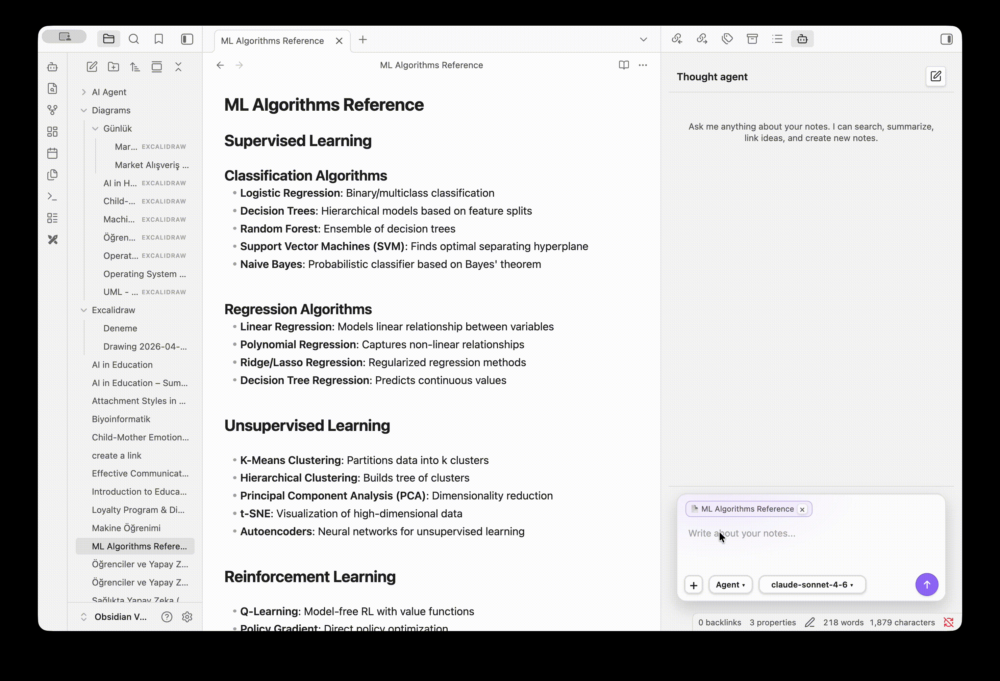
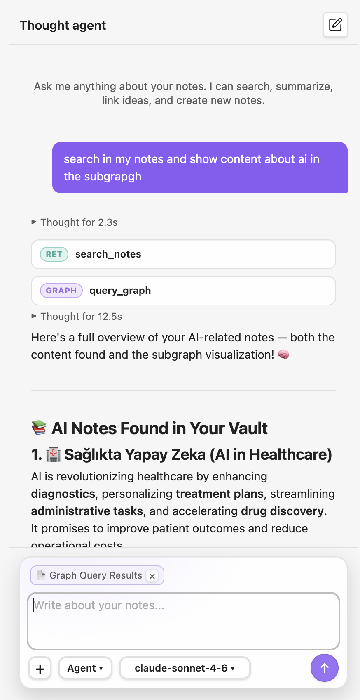
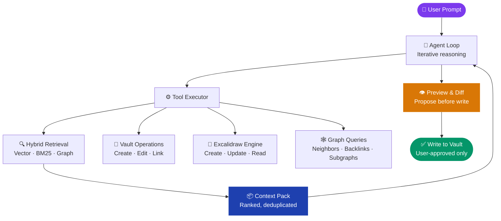
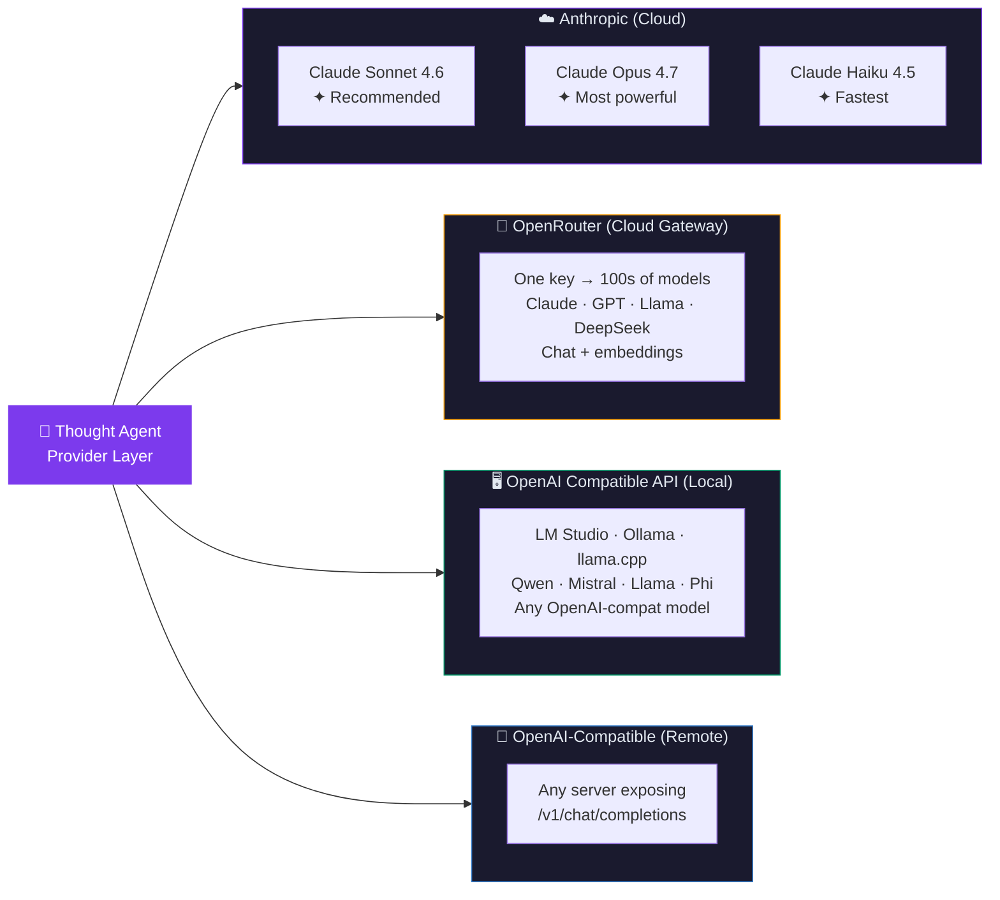
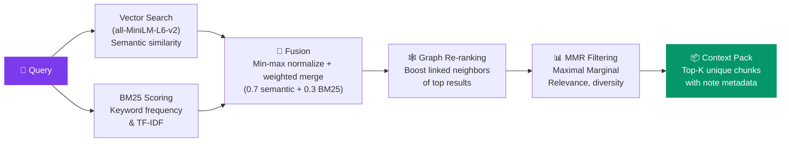
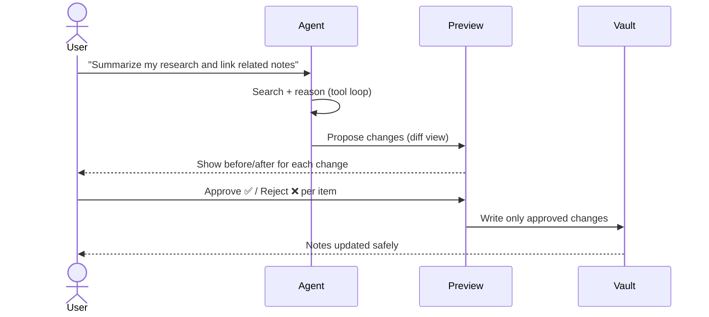
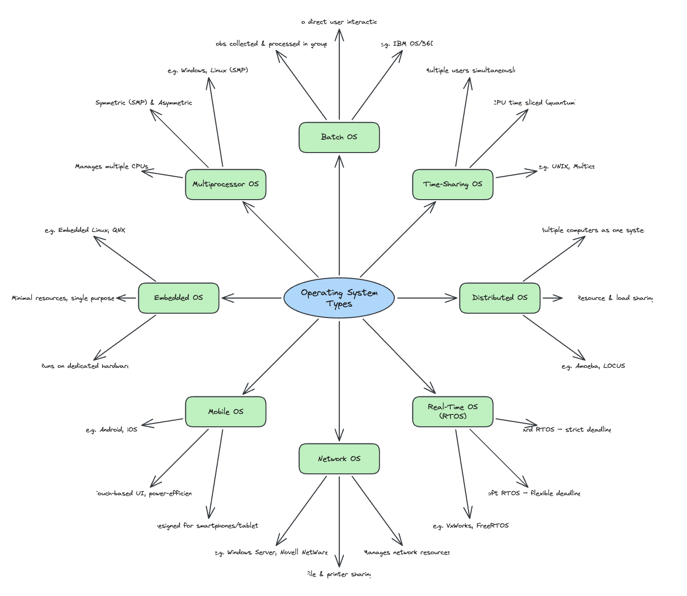
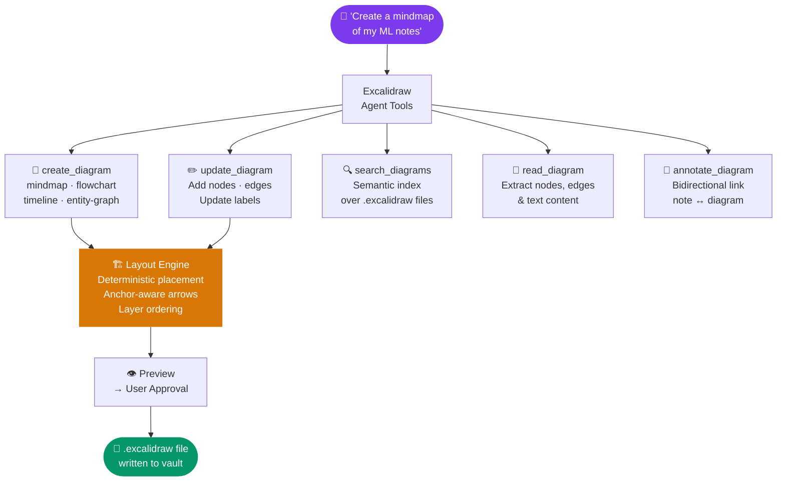
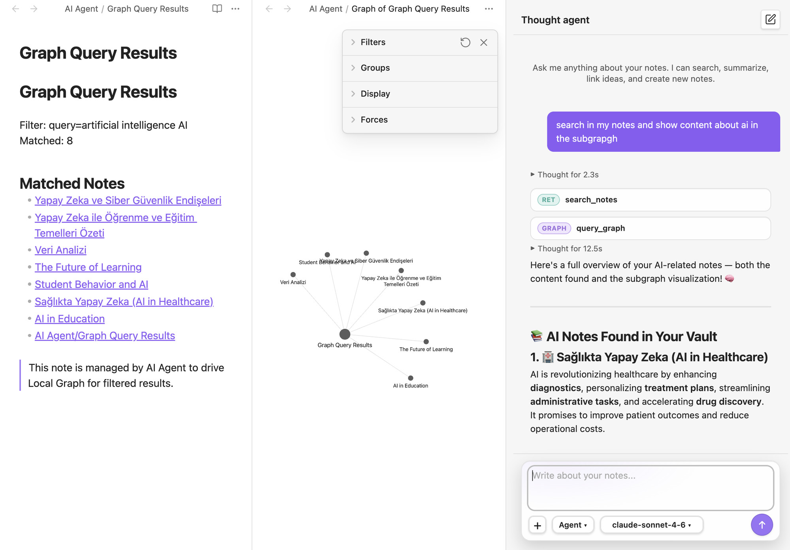

<div align="center">

# 🧠 Thought Agent

### _Your vault doesn't just store knowledge, it thinks with you._

**An AI-powered Obsidian plugin that treats your notes, links, and diagrams as a living knowledge graph.**



[](./manifest.json)
[](https://obsidian.md)
[](https://community.obsidian.md/plugins/thought-agent)
[](./LICENSE)
[](https://www.typescriptlang.org/)
[](https://nodejs.org/)

</div>

---

## ✦ What is Thought Agent?

Thought Agent is not a chatbot bolted onto your notes. It is an **autonomous reasoning agent** that navigates your vault like a researcher, searching semantically, traversing graph links, proposing safe edits, and generating visual diagrams, all without touching a single file until _you_ approve.

> _"Think of it as a second brain for your second brain."_

---

## 📦 Installation

### Option 1, Obsidian Community Plugins (recommended)

1. Open Obsidian → **Settings → Community Plugins → Browse**.
2. Search for **"Thought Agent"**.
3. Click **Install**, then **Enable**.

That's it — no BRAT, no manual file copying.

> You can also open the plugin page directly: [community.obsidian.md/plugins/thought-agent](https://community.obsidian.md/plugins/thought-agent)

---

### Option 2, BRAT

[BRAT](https://github.com/TfTHacker/obsidian42-brat) lets you install plugins directly from GitHub and get pre-release updates.

1. Install **Obsidian42 - BRAT** from the Community Plugins store.
2. Open Obsidian → **Settings → BRAT → Add Beta Plugin**.
3. Paste the repository URL:
   ```
   https://github.com/Tuguberk/Thought-Agent-Obsidian
   ```
4. Click **Add Plugin**, BRAT downloads and enables it automatically.
5. Go to **Settings → Community Plugins** and toggle **Thought Agent** on.

---

### Option 3, Manual installation

1. Go to the [**Releases**](https://github.com/Tuguberk/Thought-Agent-Obsidian/releases) page and download the latest:
   - `main.js`
   - `manifest.json`
   - `styles.css`
2. Copy all three files into your vault's plugins folder:
   ```
   <your-vault>/.obsidian/plugins/thought-agent/
   ```
3. Restart Obsidian (or reload without saving).
4. Go to **Settings → Community Plugins** and toggle **Thought Agent** on.

---

### Option 4, Build from source

```bash
# Clone into your vault's plugins folder
git clone https://github.com/Tuguberk/Thought-Agent-Obsidian \
  "<your-vault>/.obsidian/plugins/thought-agent"

cd "<your-vault>/.obsidian/plugins/thought-agent"
npm install
npm run build
```

Then enable the plugin in Obsidian as above.

---

## 🚀 Quick Start

### Step 1, Configure a provider

Open **Obsidian → Settings → Thought Agent** and pick your LLM provider:

**Using Anthropic (Claude):**

- Set **Provider** → `Anthropic`
- Paste your [Anthropic API key](https://console.anthropic.com/) (`sk-ant-...`)
- Select a model, **Claude Sonnet 4.6** is recommended for the best balance of speed and power

**Using OpenRouter (hundreds of models, one key):**

- Set **Provider** → `OpenRouter`
- Paste your [OpenRouter API key](https://openrouter.ai/keys) (`sk-or-...`)
- Enter a model slug such as `anthropic/claude-3.7-sonnet`, `deepseek/deepseek-v4-pro`, or `openai/gpt-4o-mini`, browse the full catalog at [openrouter.ai/models](https://openrouter.ai/models)
- Hit **Test** to verify the key and model, then switch models any time from the chat header

**Using a local model (OpenAI compatible API):**

- Start any OpenAI-compatible local server (e.g. [LM Studio](https://lmstudio.ai), [Ollama](https://ollama.com), llama.cpp)
- Set **Provider** → `OpenAI compatible API`
- Default URL is `http://localhost:1234/v1`, hit **Test** to confirm it's reachable
- Your prompts never leave your machine 🔒

---

### Step 2, Index your vault

In **Settings → Thought Agent**, click **Re-index vault**.  
This builds the local semantic index (~25 MB model download on first run). You only need to do this once, and again after adding many new notes.

> **Embedding provider:** The default embedder is a bundled local model (desktop only). On mobile — or to offload embedding to the cloud — open **Settings → Thought Agent → Embeddings** and choose **OpenAI**, **Google**, or **OpenRouter**, then paste the matching API key. Changing the embedding provider requires re-indexing the vault.

---

### Step 3, Open the chat

Click the **🧠 Thought Agent** icon in the left sidebar (or run _"Open Thought Agent chat"_ from the Command Palette).



**Example prompts to try:**

```
"What do my notes say about machine learning?"
"Summarize my research on [[Attention Mechanisms]] and link related notes"
"Create a mindmap of my project ideas"
"Find notes I haven't linked yet about distributed systems"
"What are the backlinks to my MOC note?"
```

---

### Step 4, Review & approve changes

The agent will **never write to your vault without showing you a preview first**.  
Every proposed note creation, edit, and diagram goes through a diff view, approve or reject each change individually.

---

## 🖼️ Multimodal Input

Attach images and PDFs directly to your messages using the **+** button in the chat composer.

- **Images** (JPEG, PNG, GIF, WEBP) — sent as-is to vision-capable models
- **PDFs** — text is extracted client-side via Obsidian's built-in PDF.js and sent as readable content; no PDF data leaves your machine for local models
- Attach multiple files at once; each appears as a chip with a thumbnail preview
- Attachments are cleared automatically after each message

---

## 🏗️ System Architecture


```mermaid
flowchart TD
    U(["👤 User Prompt"]) --> AL["🔄 Agent Loop\nIterative reasoning"]

    AL --> TE["⚙️ Tool Executor"]

    TE --> R["🔍 Hybrid Retrieval\nVector · BM25 · Graph"]
    TE --> V["📝 Vault Operations\nCreate · Edit · Link"]
    TE --> D["🎨 Excalidraw Engine\nCreate · Update · Read"]
    TE --> G["🕸️ Graph Queries\nNeighbors · Backlinks · Subgraphs"]

    R --> CP["📦 Context Pack\nRanked, deduplicated"]
    CP --> AL

    AL --> PR["👁️ Preview & Diff\nPropose before write"]
    PR --> W(["✅ Write to Vault\nUser-approved only"])

    style U fill:#7c3aed,color:#fff,stroke:none
    style W fill:#059669,color:#fff,stroke:none
    style PR fill:#d97706,color:#fff,stroke:none
    style CP fill:#1e40af,color:#fff,stroke:none
```

---

## 🔌 LLM Provider Support

Thought Agent is **provider-agnostic**. Choose the model that fits your workflow.


```mermaid
flowchart LR
    TA["🧠 Thought Agent\nProvider Layer"] --> AN
    TA --> OR
    TA --> LM
    TA --> OA

    subgraph AN["☁️ Anthropic (Cloud)"]
        C1["Claude Sonnet 4.6\n✦ Recommended"]
        C2["Claude Opus 4.7\n✦ Most powerful"]
        C3["Claude Haiku 4.5\n✦ Fastest"]
    end

    subgraph OR["🔗 OpenRouter (Cloud Gateway)"]
        R1["One key → 100s of models\nClaude · GPT · Llama · DeepSeek\nChat + embeddings"]
    end

    subgraph LM["🖥️ OpenAI Compatible API (Local)"]
        L1["LM Studio · Ollama · llama.cpp\nQwen · Mistral · Llama · Phi\nAny OpenAI-compat model"]
    end

    subgraph OA["🔗 OpenAI-Compatible (Remote)"]
        O1["Any server exposing\n/v1/chat/completions"]
    end

    style TA fill:#7c3aed,color:#fff,stroke:none
    style AN fill:#1a1a2e,color:#e2e8f0,stroke:#7c3aed,stroke-width:1px
    style OR fill:#1a1a2e,color:#e2e8f0,stroke:#f59e0b,stroke-width:1px
    style LM fill:#1a1a2e,color:#e2e8f0,stroke:#059669,stroke-width:1px
    style OA fill:#1a1a2e,color:#e2e8f0,stroke:#3178c6,stroke-width:1px
```

| Provider                  | Setup            | Privacy    | Models                                 | Best For                     |
| ------------------------- | ---------------- | ---------- | -------------------------------------- | ---------------------------- |
| **Anthropic**             | API key          | Cloud      | Claude Sonnet / Opus / Haiku           | Best reasoning quality       |
| **OpenRouter**            | API key          | Cloud      | 100s (Claude · GPT · Llama · DeepSeek) | Widest model choice, one key |
| **OpenAI compatible API** | `localhost:1234` | 100% local | LM Studio · Ollama · llama.cpp         | Offline / private vaults     |

> OpenRouter also powers **cloud embeddings** — select it under **Settings → Thought Agent → Embeddings** to use models like `openai/text-embedding-3-small` for semantic search (handy on mobile, where the local embedder isn't available).

---

## 🔍 Retrieval Pipeline

Every query runs through a **multi-stage hybrid search** before the agent sees any context.


```mermaid
flowchart LR
    Q["🔎 Query"] --> V["Vector Search\n(all-MiniLM-L6-v2)\nSemantic similarity"]
    Q --> B["BM25 Scoring\nKeyword frequency\n& TF-IDF"]

    V --> F["🔀 Fusion\nMin-max normalize + weighted merge\n(0.7 semantic + 0.3 BM25)"]
    B --> F

    F --> GR["🕸️ Graph Re-ranking\nBoost linked neighbors\nof top results"]
    GR --> MM["📊 MMR Filtering\nMaximal Marginal\nRelevance, diversity"]
    MM --> CTX["📦 Context Pack\nTop-K unique chunks\nwith note metadata"]

    style Q fill:#7c3aed,color:#fff,stroke:none
    style CTX fill:#059669,color:#fff,stroke:none
```

---

## ✏️ Safe Write Workflow

> _"Nothing touches your vault without your eyes on it first."_


```mermaid
sequenceDiagram
    actor User
    participant Agent
    participant Preview
    participant Vault

    User->>Agent: "Summarize my research and link related notes"
    Agent->>Agent: Search + reason (tool loop)
    Agent->>Preview: Propose changes (diff view)
    Preview-->>User: Show before/after for each change
    User->>Preview: Approve ✅ / Reject ❌ per item
    Preview->>Vault: Write only approved changes
    Vault-->>User: Notes updated safely
```

---

## 🎨 Excalidraw Integration

Generate, update, and search visual diagrams, directly from natural language.




```mermaid
flowchart TD
    NL(["💬 'Create a mindmap\nof my ML notes'"]) --> EA["Excalidraw\nAgent Tools"]

    EA --> T1["📐 create_diagram\nmindmap · flowchart\ntimeline · entity-graph"]
    EA --> T2["✏️ update_diagram\nAdd nodes · edges\nUpdate labels"]
    EA --> T3["🔍 search_diagrams\nSemantic index\nover .excalidraw files"]
    EA --> T4["📖 read_diagram\nExtract nodes, edges\n& text content"]
    EA --> T5["🔗 annotate_diagram\nBidirectional link\nnote ↔ diagram"]

    T1 --> LE["🏗️ Layout Engine\nDeterministic placement\nAnchor-aware arrows\nLayer ordering"]
    T2 --> LE
    LE --> PR["👁️ Preview\n→ User Approval"]
    PR --> OUT(["📄 .excalidraw file\nwritten to vault"])

    style NL fill:#7c3aed,color:#fff,stroke:none
    style OUT fill:#059669,color:#fff,stroke:none
    style LE fill:#d97706,color:#fff,stroke:none
```

**Supported diagram types:**

| Type           | Description                 | Use case                    |
| -------------- | --------------------------- | --------------------------- |
| `mindmap`      | Hierarchical radial tree    | Brainstorming, concept maps |
| `flowchart`    | Process with decision nodes | Algorithms, workflows       |
| `timeline`     | Chronological node chain    | History, project planning   |
| `entity-graph` | Relationship network        | Knowledge graphs, ERDs      |

---

## 🛠️ Agent Tool Inventory

The agent has **14 tools** across two categories:

<details>
<summary><strong>📚 Vault Tools (always available)</strong></summary>

| Tool                     | Description                                                         |
| ------------------------ | ------------------------------------------------------------------- |
| `search_notes`           | Hybrid semantic + keyword search over the entire vault              |
| `get_note`               | Fetch full content of any note by path                              |
| `get_neighbors`          | Walk outgoing/incoming links to depth N                             |
| `get_backlinks`          | Find all notes pointing to a target note                            |
| `query_graph`            | Filter & visualize a subgraph (opens visual graph view) — see below |
| `create_note`            | Propose a new note (preview → approval)                             |
| `edit_note`              | Propose changes to an existing note (diff preview)                  |
| `link_notes`             | Add a wikilink between two notes (preview → approval)               |
| `reorganize`             | Multi-step vault restructuring with per-step approval               |
| `set_session_constraint` | Scope agent to specific tags/folders for the session                |

</details>



<details>
<summary><strong>🎨 Diagram Tools (requires Excalidraw plugin)</strong></summary>

| Tool               | Description                                                  |
| ------------------ | ------------------------------------------------------------ |
| `create_diagram`   | Generate new `.excalidraw` from semantic node/edge structure |
| `update_diagram`   | Add nodes/edges or relabel existing diagram                  |
| `search_diagrams`  | Semantic search over the diagram index                       |
| `read_diagram`     | Extract structured content from any `.excalidraw` file       |
| `annotate_diagram` | Bidirectionally link a note and a diagram                    |

</details>

---

## ⚡ Getting Started to Development

### Requirements

- **Obsidian Desktop** 1.7.2+
- **Node.js** 18+
- **npm**
- _(Optional)_ [Excalidraw Obsidian plugin](https://github.com/zsviczian/obsidian-excalidraw-plugin) for diagram features

### Installation (Development)

```bash
# 1. Clone into your vault's plugins folder
git clone https://github.com/Tuguberk/Thought-Agent-Obsidian \
  /path/to/vault/.obsidian/plugins/thought-agent

# 2. Install dependencies
cd thought-agent && npm install

# 3. Start the dev build (watches for changes)
npm run dev

# 4. Enable "Thought Agent" in Obsidian → Settings → Community Plugins
```

### Production build

```bash
npm run build
```

---

## 📄 License

MIT © [Tuğberk Akbulut](https://github.com/tuguberk)

---

<div align="center">

_Built with ❤️ for people who think in graphs._

</div>
